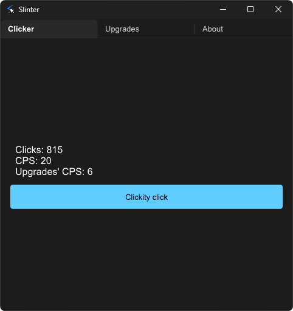

    

<h1 align="center">Slinter</h1>

  

Slinter is a bare-bones clicker "game" created using [Slint](https://slint.rs/) for the front-end, and [Rust](https://www.rust-lang.org/) for the back-end. Created for the main reason of learning both of the said technologies.

## Running in a developer environment
Running is pretty straight forward.
- clone this repository
- run `cargo run` in the directory

## Building
Building is also the same.
- clone this repository
- run `cargo build --release` in the directory
- and go to `target/release` to find the executable

## License
Slinter is released under the GNU General Public License v3.0 license.